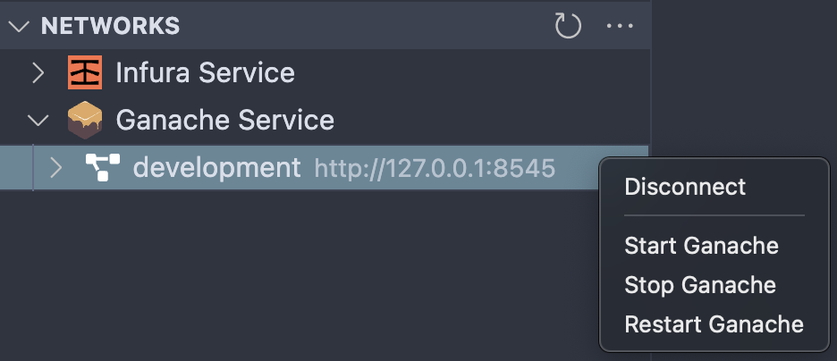

# Connect to Ganache local blockchain and deploy contracts

With Ganache running, you can right-click on your smart contract file and select the "Deploy Contracts" option.
This lists all the available networks, including those from your `truffle-config` file and networks you created using the extension (Infura and Ganache).
Next, select the Ganache network and watch the extension deploy your contract to Ganache.

**That’s it, now you have all you need to start building the right way!**
