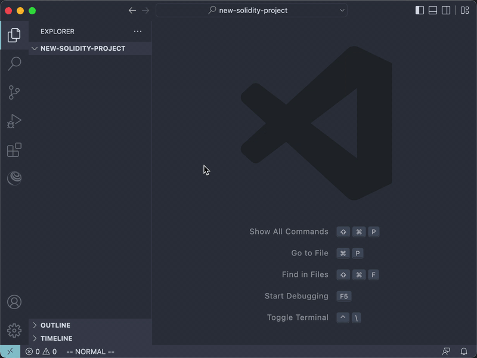

# Create new Solidity Project

You can start a new Truffle project from scratch or from a Truffle Box.

[Truffle Boxes](https://trufflesuite.com/boxes/) are helpful boilerplates that allow you to focus on what makes your dapp unique.
In addition to Truffle, Truffle Boxes can contain other helpful modules,
Solidity contracts & libraries, front-end views and more;
all the way up to complete example dapps.
